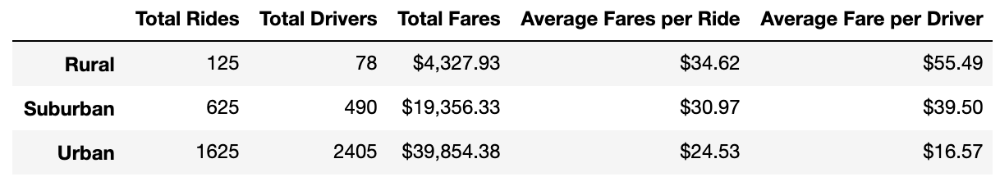

# Pyber_Analysis

## Overview:

The purpose of this analysis was to discover trends in fares by city type in the PyBer ride history data.

## Results:

Total Rides, Drivers, and Fares increase as the city type increases in population/poulation density as could be expected. However, the Average Fare per Ride and Driver decreases as population increases. Rural areas have fewer drivers and probably driver longer distances when they do take rides; therefore they make more money per ride than drivers in Suburban and Urban areas.

## Summary/Reccomendations:

If you refer to the number of drivers and rides urban areas, you'll notice that the number of drivers in urban areas outnumbers the number of rides over this period. PyBer could take more profit per fare from this demographic as the supply of drivers perhaps outpaces the demand. Urban drivers have the lowest average fare per ride and driver.

By the same token, Suburban and Rural areas might be underserved by drivers as their average fares are much higher. Adding incentives for drivers in those areas might help increase the number of rides and therefore increase revenue (particularly in suburban areas).

Finally, people in Rural areas might not be using PyBer as much because they are not as aware of the PyBer product. Perhaps advertising more in those markets would increase brand awareness.
